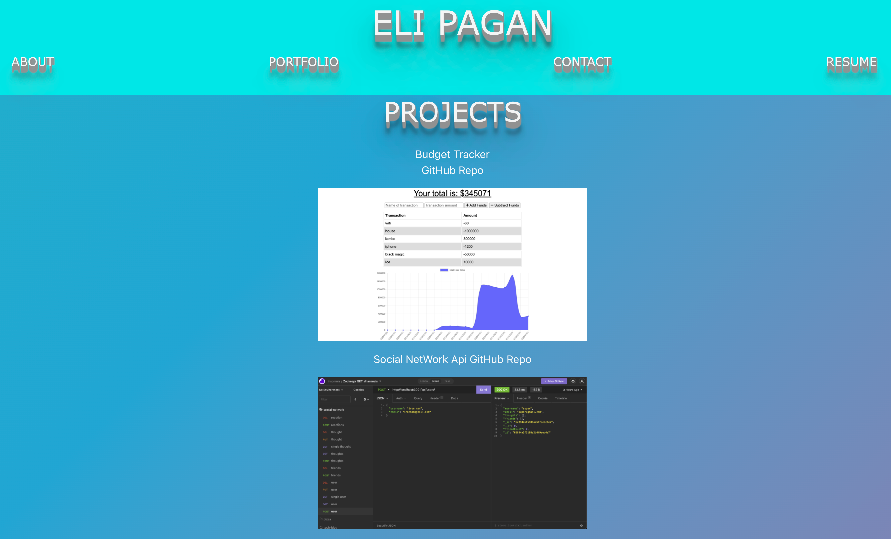

# React-Portfolio

## Description
Creating a portfolio website using React

## Technologies
* React
* JavaScript
* Bootstrap
* Css

## Preview

## References
https://reactjs.org/  
https://getbootstrap.com/docs/5.1/components/carousel/  
https://freefrontend.com/css-3d-text-effects/  

## GitHub
https://github.com/EliP2389/eli-portfolio.git

## Deployed App
https://elip2389.github.io/eli-portfolio/

